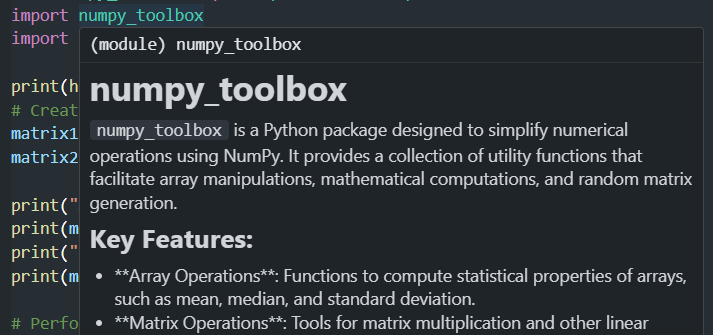

## Building a Reusable Python Toolbox for Common Tasks

One effective strategy for managing frequently used methods in your Python projects is to create a personal toolbox of reusable functions. This approach simplifies repetitive tasks and enhances productivity. For example, if you often need to read and parse files with unconventional formats, you can create a toolbox module to handle such tasks effortlessly.

### Example  Creating a Python Toolbox for Numerical Operations with NumPy
In this example, we'll build a simple Python package that uses NumPy to perform various numerical operations, such as array manipulation and mathematical functions. This guide will walk you through setting up the package, writing the code, and using it in your projects.

### Step 1: Set Up the Package Directory Structure

First, we'll set up the directory structure for our toolbox package. This includes creating the necessary folders and files to define our package and its functionalities.

```bash
mkdir -p numpy_toolbox/numpy_toolbox
touch numpy_toolbox/numpy_toolbox/__init__.py
touch numpy_toolbox/setup.py
```

### Step 2: Define the Package with `setup.py`

Create a `setup.py` file in the `numpy_toolbox` directory to define the package and its dependencies. This file tells Python how to install the package.

```python
from setuptools import setup, find_packages

setup(
    name='numpy_toolbox',
    version='0.1',
    author='Eslam Mohamed',
    author_email='your.email@example.com',
    description='A toolbox for numerical operations with NumPy',
    long_description=open('README.md').read(),
    long_description_content_type='text/markdown',
    url='https://github.com/username/numpy_toolbox',
    license='MIT',
    keywords='numpy numerical operations matrix statistics',
    python_requires='>=3.6',
    classifiers=[
        'Development Status :: 3 - Alpha',
        'Intended Audience :: Developers',
        'License :: OSI Approved :: MIT License',
        'Programming Language :: Python :: 3.6',
        'Programming Language :: Python :: 3.7',
        'Programming Language :: Python :: 3.8',
        'Programming Language :: Python :: 3.9',
        'Programming Language :: Python :: 3.10',
        'Programming Language :: Python :: 3.11',
        'Programming Language :: Python :: 3.12',
        'Operating System :: OS Independent',
    ],
    packages=find_packages(),
    install_requires=[
        'numpy>=1.21.0',
    ],
    entry_points={
        'console_scripts': [
            'numpy-toolbox-cli=numpy_toolbox.cli:main',
        ],
    },
    package_data={
        'numpy_toolbox': ['data/*.dat'],
    },
    include_package_data=True,
    zip_safe=False,
    extras_require={
        'dev': ['pytest', 'sphinx'],
        'docs': ['sphinx'],
    },
    test_suite='tests',
)


```

Follow [This](/Setup_parameters.md) for further explaination of the purpose and details of each parameter used

### Step 3: Implement Functions in `operations.py`

Create a module named `operations.py` inside the `numpy_toolbox/numpy_toolbox` directory. This module will contain various numerical operations using NumPy.

```python
# numpy_toolbox/numpy_toolbox/operations.py
import numpy as np

def array_statistics(arr):
    """
    Calculate statistics of a NumPy array.

    Args:
        arr (np.ndarray): Input array.

    Returns:
        dict: A dictionary with mean, median, and standard deviation of the array.
    """
    return {
        'mean': np.mean(arr),
        'median': np.median(arr),
        'std_dev': np.std(arr)
    }

def matrix_multiplication(matrix1, matrix2):
    """
    Perform matrix multiplication using NumPy.

    Args:
        matrix1 (np.ndarray): First matrix.
        matrix2 (np.ndarray): Second matrix.

    Returns:
        np.ndarray: Result of the matrix multiplication.
    """
    return np.dot(matrix1, matrix2)

def create_random_matrix(rows, cols):
    """
    Create a random matrix with specified dimensions.

    Args:
        rows (int): Number of rows.
        cols (int): Number of columns.

    Returns:
        np.ndarray: Random matrix with values between 0 and 1.
    """
    return np.random.rand(rows, cols)
```

### Step 4: Install the Package

Navigate to the `numpy_toolbox` directory and install the package in editable mode:

```bash
python3 -m pip install -e .
```

### Step 5: Using Your Toolbox

Now you can use the functions defined in your `numpy_toolbox` package in your Python scripts. Here’s an example script demonstrating how to use these functions:

```python
# example_usage.py
from numpy_toolbox import operations as ops
import numpy as np

# Create a random matrix
matrix1 = ops.create_random_matrix(3, 2)
matrix2 = ops.create_random_matrix(2, 4)

print("Matrix 1:")
print(matrix1)
print("\nMatrix 2:")
print(matrix2)

# Perform matrix multiplication
result_matrix = ops.matrix_multiplication(matrix1, matrix2)
print("\nResult of Matrix Multiplication:")
print(result_matrix)

# Calculate statistics of a NumPy array
array = np.array([1, 2, 3, 4, 5, 6, 7, 8, 9])
stats = ops.array_statistics(array)
print("\nArray Statistics:")
print(stats)
```

### Detailed Explanation

1. **Directory Structure**:
   - `numpy_toolbox/`: Root directory for the package.
   - `numpy_toolbox/numpy_toolbox/`: Contains the package code.
   - `numpy_toolbox/numpy_toolbox/__init__.py`: Marks the directory as a Python package.
   - `numpy_toolbox/setup.py`: Defines package metadata and dependencies.

2. **Setup File**:
   - `name`: Name of the package.
   - `version`: Version number of the package.
   - `packages`: Finds all packages within the directory.
   - `install_requires`: Lists the dependencies (e.g., NumPy).

3. **Operations Module**:
   - `array_statistics()`: Computes mean, median, and standard deviation of a NumPy array.
   - `matrix_multiplication()`: Multiplies two matrices using NumPy's `np.dot` function.
   - `create_random_matrix()`: Generates a matrix with random values between 0 and 1.

4. **Using the Package**:
   - **`example_usage.py`**: Demonstrates how to import and use the functions from `numpy_toolbox`.
   - Creates random matrices and performs matrix multiplication.
   - Calculates statistics for a sample NumPy array.

### Benefits of Using a Toolbox

1. **Modularity**: Organize and reuse code effectively.
2. **Maintainability**: Easy to update and manage functions in a single location.
3. **Consistency**: Ensure consistent usage of functions across different projects.

By setting up your own Python toolbox with reusable functions, you streamline development processes and enhance code reusability. This approach not only saves time but also ensures that you maintain a high standard of code quality and organization.


## Creating a docstring for  numpy_toolbox
Creating a docstring for the package itself involves providing an overview of the package’s purpose, features, and usage. This package-level docstring should be placed in the __init__.py file of your package directory. It serves as the primary reference for users to understand what the package offers at a high level.

File Structure
Assuming your package directory structure is:

```
numpy_toolbox/
    __init__.py
    operations.py
    setup.py
    README.md
```

#### Content of __init__.py
In the numpy_toolbox/__init__.py file, you should include a docstring at the top.


```py
"""
numpy_toolbox
=============

`numpy_toolbox` is a Python package designed to simplify numerical operations using NumPy. It provides a collection of utility functions that facilitate array manipulations, mathematical computations, and random matrix generation.

Key Features:
-------------
- **Array Operations**: Functions to compute statistical properties of arrays, such as mean, median, and standard deviation.
- **Matrix Operations**: Tools for matrix multiplication and other linear algebra operations.
- **Random Matrix Generation**: Methods to create matrices with random values for testing and simulations.

Installation:
-------------
To install `numpy_toolbox`, use the following pip command:

    pip install numpy_toolbox

Usage:
------
Import the package and use its functions as demonstrated below:

```python
from numpy_toolbox import operations as ops
import numpy as np

# Example: Compute statistics of an array
arr = np.array([1, 2, 3, 4, 5])
stats = ops.array_statistics(arr)
print(stats)

# Example: Perform matrix multiplication
matrix1 = np.array([[1, 2], [3, 4]])
matrix2 = np.array([[5, 6], [7, 8]])
result = ops.matrix_multiplication(matrix1, matrix2)
print(result)

# Example: Create a random matrix
random_matrix = ops.create_random_matrix(2, 3)
print(random_matrix)
"""
```
This docstring will be displayed when users use `help(numpy_toolbox)` or view the package’s documentation by going over the package name.


